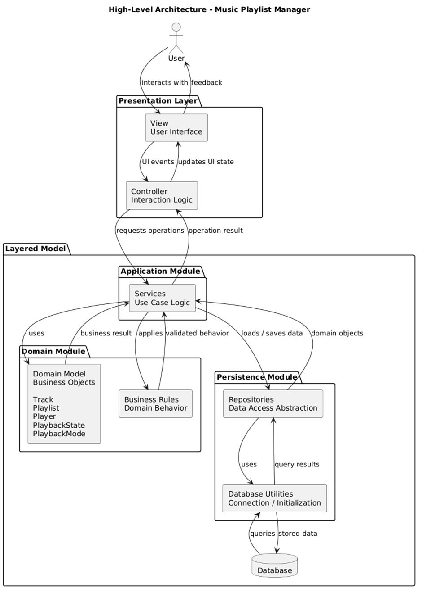

# Software Architecture — Music Playlist Manager

**Project:** Music Playlist Manager  
**Course:** Software Architecture Design — A.Y. 2025/2026  
**Architecture style:** Model-View-Controller (MVC) with a layered Model  
**Main goal:** separate user interface, application logic, domain logic and persistence, so that the system is easier to test, maintain and evolve during the Scrum sprints.

---

## 1. High-Level Architecture

The Music Playlist Manager is a Java desktop application for managing music tracks, playlists, simulated playback and advanced filters. The architecture combines the **Model-View-Controller (MVC)** pattern with a **layered internal Model**.



At a high level, the system is divided into four main areas:

1. **Presentation Layer**  
   Manages the interaction with the user. It contains the graphical views and the controllers that receive UI events.

2. **Application Module**  
   Coordinates the application use cases. It exposes services and a facade used by the controllers. It does not contain UI code.

3. **Domain Module**  
   Contains the core business concepts and rules of the application, such as tracks, playlists and simulated playback behavior.

4. **Persistence Module**  
   Isolates data access. It contains repository abstractions, SQLite repository implementations and database utilities.

The main dependency flow is:

```text
User
→ View
→ Controller
→ Application Facade / Services
→ Domain Model
→ Repository Interfaces
→ SQLite Repository Implementations
→ Database
```

The architectural rule is that external layers depend on internal services through clear interfaces. The UI must not directly access the database and must not implement business rules. Controllers translate user actions into application operations. Application services coordinate domain objects and repositories. Domain objects contain the main business behavior and remain independent from UI and database details.

---

## 2. MVC Architectural Choice

The project adopts **MVC** to separate graphical interaction from application behavior.

### View

The View contains the graphical components shown to the user. Its responsibility is to display data and collect input. In this project, the views show the music catalog, playlists, current track, playback state, playback mode and operation feedback.

The View does not decide business behavior. For example, it must not decide whether a playlist name is duplicated, whether a track can be removed, or which track comes next during playback.

### Controller

The Controller receives UI events, such as button clicks or form submissions, and translates them into calls to the application layer. It updates the View using the results returned by the facade or services.

The Controller acts as a bridge between UI and application logic. It should not directly manipulate the database and should not contain domain rules.

### Model

In this project, the Model is not a single class or a single package. It is organized as a layered Model composed of:

```text
Application Module
Domain Module
Persistence Module
```

This choice keeps the UI thin and allows the main logic to be tested with JUnit without launching the graphical interface.

---

## 3. Package Structure

```text
it.unisa.sad.playlistmanager
│
├── Main.java
│
├── ui
│   ├── view
│   │   ├── MainView
│   │   ├── TrackView
│   │   ├── PlaylistView
│   │   └── PlaybackView
│   │
│   └── controller
│       ├── MainController
│       ├── TrackController
│       ├── PlaylistController
│       └── PlaybackController
│
├── application
│   ├── facade
│   │   └── MusicPlaylistManagerFacade
│   │
│   └── service
│       ├── TrackService
│       ├── PlaylistService
│       └── PlaybackService
│
├── domain
│   ├── model
│   │   ├── Track
│   │   ├── Playlist
│   │   ├── Player
│   │   ├── PlaybackState
│   │   └── PlaybackMode
│   │
│   └── strategy
│       ├── PlaybackStrategy
│       ├── SequentialPlaybackStrategy
│       ├── ShufflePlaybackStrategy
│       └── LoopPlaybackStrategy
│
└── persistence
    ├── repository
    │   ├── TrackRepository
    │   ├── PlaylistRepository
    │   ├── SqliteTrackRepository
    │   └── SqlitePlaylistRepository
    │
    └── db
        ├── DatabaseConnectionManager
        └── DatabaseInitializer
```

---

## 4. Layered Model and Module Responsibilities

## 4.1 Root Package

The root package contains the application entry point.

**Responsibility:** start the application, initialize the main dependencies and open the main user interface.

`Main.java` should remain lightweight. It should not contain business logic, persistence logic or UI event logic.

---

## 4.2 Presentation Layer — `ui`

The `ui` module contains everything related to the desktop interface.

```text
ui
├── view
└── controller
```

### `ui.view`

**Responsibility:** display information and collect user input.

This package contains the visual parts of the application. It shows tracks, playlists, playback information and feedback messages. It also collects input from forms and buttons.

It must not contain business rules. Its role is only presentation.

### `ui.controller`

**Responsibility:** receive UI events and delegate operations to the application layer.

This package contains the interaction logic between the View and the Application Module. Controllers receive user actions, call the facade or services, and update the UI with the operation result.

Controllers must not directly access SQLite repositories or database utilities.

---

## 4.3 Application Layer — `application`

The `application` module coordinates use cases and acts as the boundary between UI and domain/persistence logic.

```text
application
├── facade
└── service
```

### `application.facade`

**Responsibility:** provide a simplified entry point for controllers.

The facade reduces coupling between the UI controllers and the internal service structure. Controllers can call one main interface instead of depending on many service classes.

The facade should coordinate operations, but it should not become a class containing all business logic.

### `application.service`

**Responsibility:** implement application use cases.

Services coordinate the execution of user stories, such as adding tracks, creating playlists, adding tracks to playlists, starting playback, pausing playback and changing playback mode.

Services can use domain objects and repository interfaces. They must not contain UI code.

---

## 4.4 Domain Layer — `domain`

The `domain` module contains the core business concepts of the Music Playlist Manager.

```text
domain
├── model
└── strategy
```

### `domain.model`

**Responsibility:** represent the main business entities and their core behavior.

This package contains the objects that represent the music catalog, playlists, tracks and simulated player state. It is the most important part of the business logic and should remain independent from UI and persistence details.

### `domain.strategy`

**Responsibility:** encapsulate the different playback algorithms.

This package applies the Strategy pattern to separate playback modes such as sequential, shuffle and loop. The player can use a strategy to decide the next track without hard-coding all playback algorithms inside a single class.

This keeps playback behavior easier to extend in later sprints.

---

## 4.5 Persistence Layer — `persistence`

The `persistence` module isolates storage and database access from the rest of the application.

```text
persistence
├── repository
└── db
```

### `persistence.repository`

**Responsibility:** define and implement data access operations.

Repository interfaces define the operations needed by the application layer, such as saving, updating, deleting and loading tracks or playlists. SQLite implementations contain the concrete database access logic.

The application layer should depend on repository interfaces, not directly on concrete SQLite classes.

### `persistence.db`

**Responsibility:** manage database connection and initialization.

This package centralizes database connection management and schema initialization. SQL setup and connection logic remain separated from services and domain objects.

---

## 5. Main Runtime Flow

A typical operation follows this flow:

```text
User action
→ View captures input
→ Controller receives the event
→ Facade / Service executes the use case
→ Domain objects apply business behavior
→ Repository saves or loads data
→ Controller updates the View
```

Example: when the user creates a playlist, the View collects the playlist name, the Controller receives the event, the Application Layer validates and coordinates the operation, the Domain Layer represents the playlist, the Persistence Layer stores it, and the UI is updated with the new playlist.

For playback, the UI does not decide which track comes next. The Controller delegates the command to the Application Layer, the Domain Layer manages the player state, and the selected playback strategy determines the next track.

---
