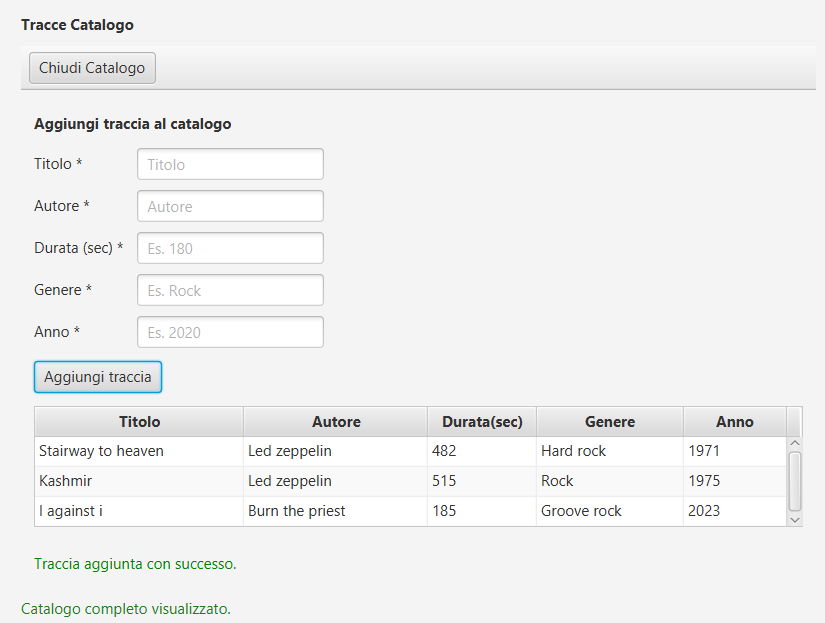
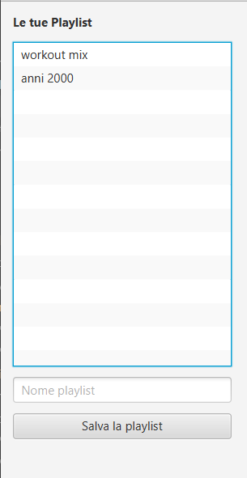
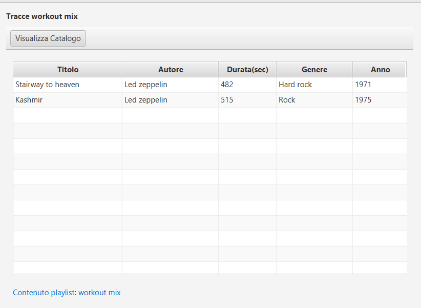
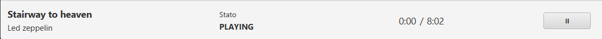
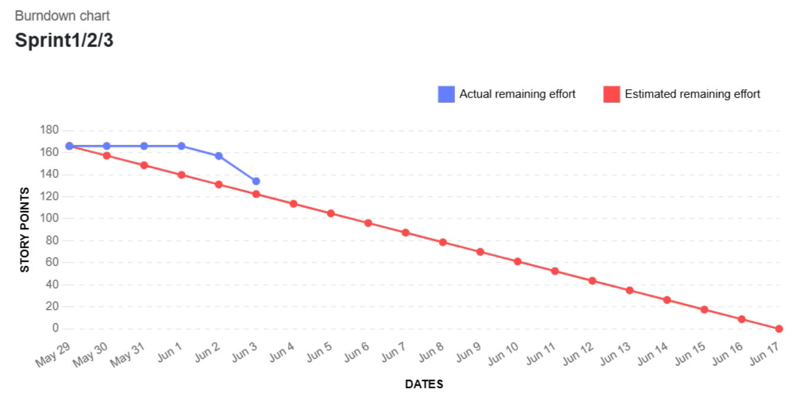

# Sprint 1 Review Report

**Project:** Music Playlist Manager  
**Course:** Software Architecture Design 2025/2026  
**Group:** n. 14 - AH  
**Sprint:** Sprint 1  

---

## 1. Sprint outcome

Durante lo Sprint 1 il team ha consegnato una prima versione funzionante del Music Playlist Manager. L’incremento permette all’utente di gestire un catalogo di tracce, creare playlist, visualizzare playlist e contenuti, aggiungere/rimuovere tracce dalle playlist e avviare una prima simulazione di playback da interfaccia grafica.

La release è orientata a una **thin slice end-to-end**: dalla UI JavaFX fino alla persistenza SQLite, passando per facade, service, domain model e repository.

### Sprint metrics

| Elemento | Valore |
|---|---:|
| Story Points pianificati | 30 SP |
| Story Points completati sullo scope pianificato | circa 30 SP, con limitazione su US-10 |
| Lavoro extra non pianificato | US-18 - Visualizzare le playlist create |
| Story Points extra conteggiati nella velocity | 0 SP |
| Velocity di riferimento per Sprint 2 | 30 SP + technical debt prioritario |

### User Stories effettivamente completate

- US-01 — Add a new track to the catalog
- US-02 — View all tracks in the catalog
- US-05 — Create a new playlist
- US-06 — View playlist content
- US-07 — Add existing tracks to a playlist
- US-08 — Remove a track from a playlist
- US-09 — Play a single track
- US-18 — Visualizzare le playlist create, completata come lavoro emerso durante lo Sprint

### User Story parzialmente completata

- US-10 — Pause a single track

US-10 è stata implementata per quanto riguarda il cambio di stato del playback da `PLAYING` a `PAUSED` e il mantenimento della traccia corrente nella UI. Non è invece pienamente soddisfatto l’Acceptance Criterion relativo al blocco del timer sul secondo esatto dell’interruzione, perché il timer di avanzamento della simulazione non è stato implementato in Sprint 1.

---

## 2. Delivered increment

L’incremento consegnato include funzionalità visibili e verificabili da interfaccia grafica:

- creazione e visualizzazione del catalogo tracce;
- creazione e visualizzazione delle playlist;
- visualizzazione del contenuto di una playlist;
- aggiunta di tracce esistenti a una playlist;
- rimozione di tracce da una playlist senza eliminarle dal catalogo;
- avvio del playback simulato di una traccia tramite menu contestuale;
- pausa del playback simulato, limitatamente allo stato logico e alla traccia corrente;
- aggiornamento della UI del playback con traccia corrente, autore, durata e stato.

### Placeholder screenshot funzionalità

#### Catalogo tracce

#### Creazione e visualizzazione playlist

#### Contenuto playlist

#### Playback simulato

## 3. Burndown chart

Il burndown chart mostra un andamento inizialmente quasi orizzontale. Questo non rappresenta inattività del team, ma una fase di setup tecnico necessaria per rendere stabile lo sviluppo successivo. Nei primi giorni lo Sprint ha richiesto attività tecniche propedeutiche: configurazione del progetto Maven/JavaFX, impostazione SQLite, definizione delle repository interface, implementazione delle repository concrete, inizializzazione dello schema del database e collegamento con facade/service.

Queste attività hanno prodotto poco avanzamento immediatamente visibile in termini di Story Points, ma hanno garantito coerenza nei livelli inferiori dell’architettura, in particolare:

- **Persistence layer**, con SQLite, `DatabaseConnectionManager`, `DatabaseInitializer` e repository concrete;
- **Application layer**, con facade e service usati come punto di passaggio tra UI e logica applicativa.

Dopo questa fase, la discesa del burndown è diventata più marcata perché il team ha potuto completare più rapidamente le User Stories funzionali costruite sopra l’infrastruttura già stabilizzata.

Gli Story Points pianificati per lo Sprint erano **30 SP**. La US-18 è stata implementata come lavoro extra emerso durante lo Sprint, ma non viene conteggiata nella velocity pianificata dello Sprint 1 per mantenere la metrica coerente con lo Sprint Backlog iniziale.

---

## 4. Issues discovered in the release

Durante la release non sono emersi blocchi funzionali critici tali da impedire la demo dello Sprint 1. Le principali criticità individuate riguardano invece la completezza di alcuni Acceptance Criteria e la qualità architetturale interna.

### 4.1 US-10 parzialmente soddisfatta

La US-10 è definita come segue:

> Come utente del lettore musicale, voglio poter mettere in pausa la traccia attualmente in riproduzione, affinché io possa interrompere momentaneamente l’ascolto simulato senza perdere il minutaggio corrente del brano.

Acceptance Criteria rilevanti:

- dato un playback in stato `Playing`, premendo `Pause` lo stato interno diventa `Paused`;
- la traccia corrente resta invariata nella UI;
- il timer di avanzamento della simulazione si blocca sul secondo esatto dell’interruzione;
- se il playback è già in `Paused`, una nuova richiesta di pausa non deve generare errori o transizioni anomale.

Nello Sprint 1 sono stati soddisfatti gli aspetti relativi allo stato logico e alla coerenza della traccia corrente. Non è stato implementato il timer di avanzamento, quindi il criterio relativo al minutaggio corrente non può essere considerato completato.

Questa parte verrà ripianificata nello Sprint 2 come completamento della simulazione del playback, includendo avanzamento temporale, pausa/ripresa sul secondo corrente ed eventuale stop automatico a fine traccia.

### 4.2 Debito tecnico architetturale

Durante l’integrazione della UI JavaFX con facade, service e persistenza, è emerso un debito tecnico legato all’accoppiamento tra controller e costruzione delle dipendenze applicative.

Attualmente parte dell’istanziazione dell’applicazione avviene nel controller principale. Questo ha permesso di integrare rapidamente UI, service, repository e database durante Sprint 1, ma introduce un accoppiamento eccessivo tra Presentation Layer e componenti infrastrutturali.

Il team considera questo punto un debito tecnico rilevante perché può limitare:

- manutenibilità;
- testabilità dei controller;
- evoluzione della UI;
- sostituzione o configurazione delle implementazioni concrete dei repository.

Per Sprint 2 verrà aggiunta una User Story tecnica ad alta priorità:

**TECH-DEBT-01 — Refactoring dell’inizializzazione applicativa e riduzione dell’accoppiamento tra controller e infrastruttura**

Obiettivo della story: spostare la composizione delle dipendenze fuori dai controller JavaFX, introducendo una classe dedicata di configurazione/bootstrap applicativo, così da mantenere i controller focalizzati sulla sola gestione degli eventi UI.

---

## 5. Issues with the Product Backlog

### 5.1 User Story emersa: US-18 — Visualizzare le playlist create

Durante Sprint 1 il team ha implementato anche la visualizzazione dell’elenco completo delle playlist create, pur non essendo stata inizialmente inclusa nello Sprint Backlog.

**US-18 — Visualizzare le playlist create**

Come utente del lettore musicale, voglio visualizzare nel Media Player l’elenco completo di tutte le playlist che ho creato, affinché io possa scorrere le mie raccolte e selezionare rapidamente quale playlist riprodurre o modificare.

Acceptance Criteria:

**Scenario 1 — Visualizzazione con più playlist presenti**

Given l’utente ha creato precedentemente 3 playlist nel sistema, ad esempio “Rock”, “Pop”, “Jazz”  
When accedo alla schermata principale del Media Player  
Then il sistema mostra l’elenco esatto di tutte e 3 le playlist con i rispettivi nomi aggiornati  
And la lista visiva si adegua dinamicamente senza richiedere il riavvio dell’applicazione

**Scenario 2 — Visualizzazione iniziale senza playlist**

Given un utente ha appena installato o avviato l’applicazione per la prima volta e non ha ancora creato alcuna playlist  
When visualizzo l’elenco delle playlist  
Then il sistema mostra l’elenco delle playlist vuoto o un testo segnaposto, ad esempio “Nessuna playlist creata”  
And non genera errori grafici

Questa User Story è emersa perché, per implementare correttamente la visualizzazione di una playlist e consentire la selezione della raccolta da modificare, era tecnicamente necessario visualizzare l’elenco delle playlist disponibili. Non implementare questa funzionalità avrebbe reso meno efficiente e meno coerente l’interazione con US-06 e US-07.

La US-18 viene quindi aggiunta al Product Backlog come story completata durante Sprint 1, ma non viene conteggiata negli Story Points pianificati dello Sprint corrente.

### 5.2 Nuova User Story: US-05.1 — Eliminare una playlist

Durante la revisione del backlog è emersa anche la necessità di esplicitare la cancellazione delle playlist.

**US-05.1 — Eliminare una playlist**

As a utente,  
I want to poter eliminare playlist da me create, vuote o popolate da tracce,  
So that possa gestire e personalizzare liberamente la mia libreria musicale, rimuovendo le raccolte non più di mio interesse.

Priorità: **High**  
Stima iniziale: **3 Story Points**

La story non è stata implementata in Sprint 1 perché non faceva parte dello Sprint Backlog iniziale congelato. Verrà valutata per Sprint 2 insieme alle altre attività di gestione avanzata delle playlist.

---

## 6. Git and integration process

Il team ha usato Git in modo strutturato durante lo Sprint:

- sviluppo su branch dedicati;
- Pull Request verso `main`;
- review del codice prima dell’integrazione;
- separazione tra feature, fix e test;
- allineamento frequente con il branch principale;
- uso di commit descrittivi per rendere tracciabile il lavoro individuale.

La presenza di pochi o nessun conflitto significativo durante l’integrazione non è casuale. È dovuta a una suddivisione abbastanza chiara delle responsabilità: alcuni membri hanno lavorato su persistenza e service, altri su UI/controller o test. Inoltre, l’uso della facade e delle repository interface ha ridotto l’impatto delle modifiche tra livelli diversi.

Questo processo ha permesso al team di integrare modifiche incrementali senza destabilizzare continuamente il branch principale, mantenendo una base dimostrabile per la Sprint Review.

---

## 7. Planning impact for Sprint 2

La velocity osservata nello Sprint 1 conferma una capacità di circa **30 Story Points**, considerando che il team ha completato quasi tutto lo scope pianificato e ha inoltre implementato una funzionalità extra, US-18, non conteggiata nella velocity ufficiale.

Per Sprint 2 il team userà come riferimento:

| Elemento | Pianificazione Sprint 2 |
|---|---:|
| Velocity funzionale stimata | 30 SP |
| Technical debt prioritario | da aggiungere sopra la pianificazione funzionale |
| Focus tecnico | riduzione accoppiamento controller/infrastruttura |
| Focus prodotto | completamento playback e gestione playlist |

La pianificazione proposta è quindi: **circa 30 SP di funzionalità + TECH-DEBT-01 ad alta priorità**, compatibilmente con il tempo disponibile e con l’impatto del refactoring.

---

## 8. Sprint Retrospective

### Start

- Introdurre una breve sessione di backlog grooming prima dello Sprint Planning.
- Esplicitare meglio le User Stories tecniche emerse durante lo sviluppo.
- Inserire prima nel backlog le attività di refactoring quando un debito tecnico viene individuato.

### More of

- Continuare a usare Pull Request piccole e revisionabili.
- Continuare a validare le modifiche con test e demo manuali.
- Mantenere chiara la separazione tra branch di feature, fix e test.

### Keep doing

- Usare GitHub e branch dedicati per tracciare il lavoro individuale.
- Usare facade, service e repository interface per evitare accessi diretti dalla UI al database.
- Mantenere il focus su incrementi funzionanti e dimostrabili.

### Less of

- Ridurre modifiche ampie ai controller senza prima concordare l’impatto architetturale.
- Ridurre codice temporaneo o workaround non documentati.
- Ridurre la sovrapposizione tra task UI e task service quando non è strettamente necessaria.

### Stop

- Evitare di introdurre funzionalità non presenti nel backlog senza registrarle subito come lavoro emerso.
- Evitare di considerare completa una User Story quando un Acceptance Criterion rilevante non è ancora soddisfatto.
- Evitare che i controller diventino il punto di creazione delle dipendenze infrastrutturali.
